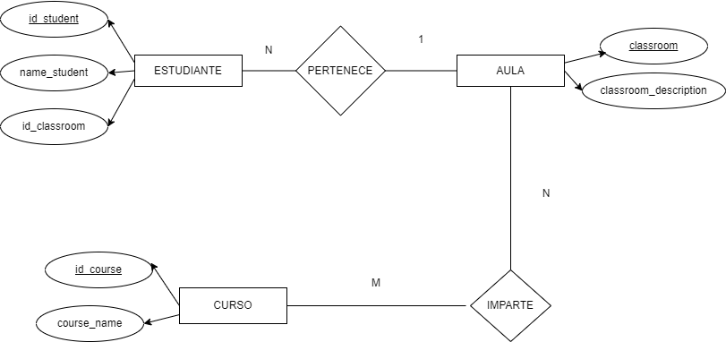
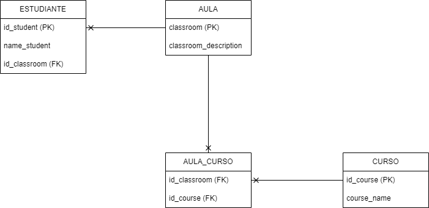

# Ej.---Students-Classrooms-Courses

## Normalización de la base de datos
Las tablas normalizadas (Estudiante, Aula, Curso, Aula_Curso) con los datos reales están disponibles aquí:
👉 [Ver Google Sheets](https://docs.google.com/spreadsheets/d/14i4glWBA4o_msboFtn__pglV3td1lV2RcXYbcZ4BmwM/edit?usp=sharing)

## Diagrama entidad-relación (Chen)

## Diagrama de base de datos (patas de gallo / UML)
